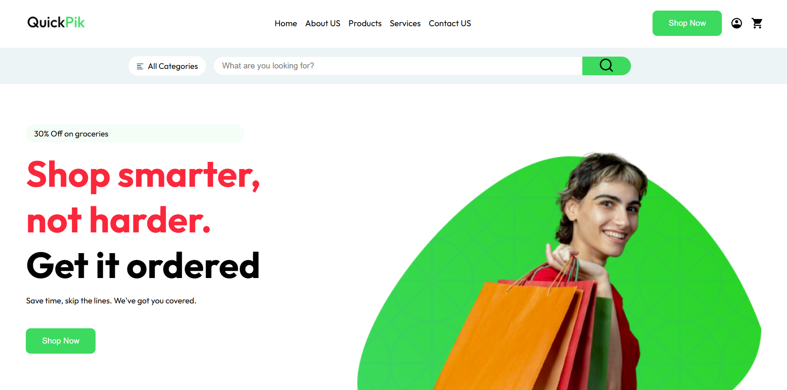

# Shopping Mall

Welcome to the **Shopping Mall** project! This repository contains the code for a modern and responsive e-commerce web page, designed to provide an optimal shopping experience.



## Table of Contents

- [Introduction](#introduction)
- [Features](#features)
- [Technologies Used](#technologies-used)
- [Getting Started](#getting-started)
- [Usage](#usage)
- [Contributing](#contributing)
- [License](#license)
- [Contact](#contact)

## Introduction

**Shopping Mall** is a sleek, user-friendly e-commerce web page designed to enhance the online shopping experience. It features a clean layout, intuitive navigation, and responsive design, making it accessible on both desktop and mobile devices.

## Features

- **Responsive Design**: Ensures the web page looks great on all devices.
- **Intuitive Navigation**: Easy access to Home, About Us, Products, Services, and Contact Us pages.
- **Interactive Elements**: Buttons and links with smooth animations for a better user experience.
- **Promotional Sections**: Highlighting trending products and special deals.
- **Customer Testimonials**: Showcasing customer reviews for credibility.
- **Sign-Up Form**: For exclusive offers and discounts.

## Technologies Used

- **HTML5**: For the basic structure of the web page.
- **CSS3**: For styling and responsive design.
- **JavaScript**: For interactive elements and animations.
- **Font Awesome**: For icons.
- **Google Fonts**: For typography.

## Getting Started

To get a local copy up and running, follow these simple steps.

### Prerequisites

Make sure you have the following installed on your local machine:

- [Git](https://git-scm.com)
- [Node.js](https://nodejs.org) (for package management and development server)

### Installation

1. Clone the repository:
   ```bash
   git clone https://github.com/shopping_webPage.git
